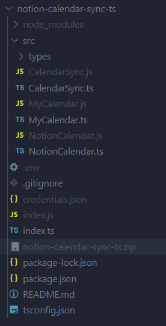

# Notion-Calendar Sync documentation

Created: June 24, 2022 8:26 AM
Status: Draft

# Introduction

Hi, this script is a porting of my personal Calendar/Notion sync script. I'm rewriting it in Typescript just for fun.

You should duplicate the Agenda database from [this template](https://www.notion.so/ab2073d5c9e54a3f8735ba00609f0f7b).

Personally, I have deployed this script in AWS using Lambda and an EventBridge cron job of 5 minutes. Of course, you can choose your preferred deployment system.

## Setup as a user

There are just few steps in order to use this integration: 

1. [Create a Notion integration](https://www.codingwithmiszu.com/2021/12/28/how-to-generate-a-notion-api-token-easily/), find the notion Token and put it in the Env variables (NOTION_TOKEN)
2. Duplicate the [base template](https://www.notion.so/ab2073d5c9e54a3f8735ba00609f0f7b)
3. Share the base template with the Notion integration
4. [Find the database id](https://stackoverflow.com/questions/67728038/where-to-find-database-id-for-my-database-in-notion) from the Notion database and put it in the Env variables (DATABASE_ID)
5. Go on Google Calendar, [find your calendar id](https://docs.simplecalendar.io/find-google-calendar-id/), and put it in the Env variables (CALENDAR_ID)

Now you can try to run the integration from the index.js and… it doesn’t work!

We are just missing a piece, we need to have permission to read from Google Calendar. To do this we have to [create access credentials](https://developers.google.com/workspace/guides/create-credentials), then we need to create a service account with google calendar api enabled and then, once we have a service account, we need to [share the Calendar with the service account](https://stackoverflow.com/questions/60036292/google-calendar-api-dont-return-shared-calendars).

Once we have downloaded credential.json we can put it into the main folder and start the src/index.ts.

Now everything should work fine and each time you run the scr/index.ts file, it will sync the notion database with your Google Calendar, starting from the new updates. In the first run will be created a test item in the Notion Database, please don’t delete that item. It will be used to load the [Sync Token](https://developers.google.com/calendar/api/guides/sync) for the next synchronizations.

Now try to change something in your calendar (for example create a new item), run src/index.ts and it will create the new event on Notion.

The best way to use this integration is with a Cronjob. If you want, please follow the next step of this guide on how to deploy on AWS Lambda using EventBridge as trigger

## Deploy on AWS (the easy way)

To deploy on AWS the Lambda function you have to compile first of all in Javascript (using the `tsc` command) which will generate the js files that will be executed. Then install the packages using `npm install` and create a zip archive containing the code and the dependencies. You should have something like this: 

Now you can [create the Lambda on AWS](https://docs.aws.amazon.com/lambda/latest/dg/lambda-nodejs.html), upload the zip file and set the env variables. Please remember to change the timeout in config to at least 20 seconds.

Now you can test the function from the Test button. If everything goes well, you will find the new test event generated in Notion.

Now we have just to [create the trigger on EventBridge](https://docs.aws.amazon.com/eventbridge/latest/userguide/eb-run-lambda-schedule.html), by creating a new rule. In my case, I want to run the function 1 time every 10 minutes. You can choose the value that you prefer.

## Known Issues

In some parts of the code I have used some `ts-ignore` that I hope to remove in the next versions

## Troubleshooting

If you find problems with source code or configuration, please contact me at info@alfonsograziano.it

I know that the configuration of this project is not so simple because it involves using GCP, Google Calendar, Notion API, and AWS services.